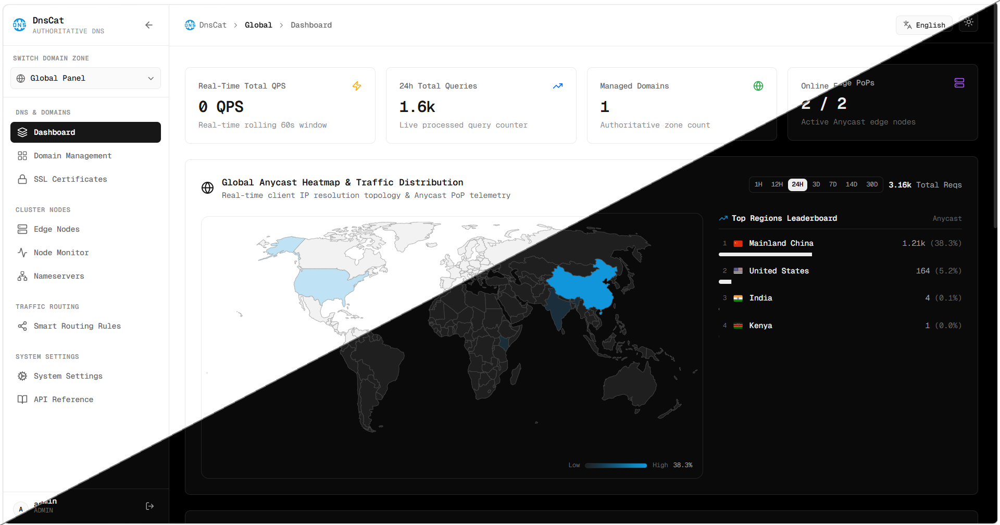

<p align="center">
  
</p>

<h1 align="center">DnsCat</h1>

<p align="center">
  
  
  
  
  
  
  
</p>

<p align="center">
  
  
  
  
  
  
</p>

[English](../README.md) | **简体中文**

DnsCat 是一套可自托管的权威 DNS 解析服务与控制面板。把域名的 NS 委派到 DnsCat 之后，它负责按你配置的解析记录对外提供权威应答，并在此之上提供 DNSSEC 签名、智能分线调度、源站健康探测与故障转移、动态 DNS、ACME 证书自动签发、查询级安全防护，以及一套多节点边缘集群。

后端用 Go 编写，DNS 引擎基于 `miekg/dns`；前端是 React + TypeScript，构建产物由后端直接托管。数据默认持久化到 SQLite，也可配置为 MySQL；Redis 承担缓存、跨节点广播与安全日志的 FIFO 持久化。

<p align="center">
  
</p>

## 功能

| 模块 | DnsCat 提供的能力 |
| --- | --- |
| 权威解析 | UDP/TCP 53、DoT (RFC 7858)、DoH (RFC 8484) 全协议入口；内存区域索引与并发查找，单节点可承载高并发查询。 |
| 记录类型 | `A` `AAAA` `CNAME` `TXT` `MX` `NS` `SRV` `CAA` `PTR` `SOA` `ALIAS/ANAME`（根域扁平化）`HTTPS` `SVCB` `TLSA` `SSHFP` `DS` `DNSKEY`。 |
| 记录管理 | 增删改查、启停切换、复选框批量操作（批量启用 / 禁用 / 删除，单事务提交）、按类型与分线筛选、搜索、分页。 |
| DNSSEC | 自动生成 KSK (257) 与 ZSK (256)，ECDSA Curve P-256 with SHA-256；实时 RRSIG 应答签名、NSEC 否定证明、密钥轮换，并给出 DS 记录参数与注册商配置指引。 |
| 智能分线 | 按大洲 / 国家 (ISO 3166-1) / ASN 三个维度定义线路，维度间为「或」关系；内置七大洲线路，支持自建线路与优先级；解析记录通过 `geo_line` 引用。 |
| ECS 与权重 | 支持 EDNS0 Client Subnet (RFC 7871) 精确子网定位；同名记录可配权重做加权轮询。 |
| 健康探测 | HTTP / HTTPS 状态码、TCP 端口连通、ICMP Echo 三种探测；连续失败自动切换到备用 IP，恢复后自动回切，可手动立即探测。 |
| 动态 DNS | dyndns2 协议端点 `/nic/update`，兼容 ddclient 与主流路由器固件；独立密钥体系，仅存 SHA-256 摘要，支持主机名白名单、来源 IP/CIDR 白名单、密钥轮换与调用留痕。 |
| SSL 证书 | ACME DNS-01 自动签发与到期续期，支持 Let's Encrypt / ZeroSSL / Buypass 等服务商与 EAB 外部账户绑定；申请人 Profile 管理、多种密钥算法、证书与私钥下载、失败原因归类诊断。 |
| 安全防护 | 逐条可开关的查询级规则：速率限制、Flood/DDoS、RRL 应答限速、IP/ASN/地区黑名单、Resolver ACL、AXFR 区域传送限制、异常 QTYPE 过滤、ANY 策略 (RFC 8482)、单域名 QPS、NXDOMAIN 随机子域（水刑）防护。 |
| 安全日志 | 被拦截查询的实时明细，支持按规则 / 处置结果 / 关键词筛选与服务端分页；保留上限可配 (100 ~ 200000)，按 FIFO 滚动，落 Redis 持久化，重启不丢。 |
| 边缘集群 | 主控 + 轻量边缘节点守护进程；Redis PubSub 广播配置变更、REST 拉取区域快照；节点自动注册、心跳上报、一键部署命令生成。 |
| 节点监控 | 每节点 CPU / 内存 / 磁盘 / 网络吞吐 / 实时 QPS / 累计查询数 / 响应延迟时序曲线，以及 Uptime 风格在线率状态条（1h ~ 30d）。 |
| 统计分析 | 全局与单域名的 QPS 趋势、查询类型分布、国家地区流量分布与世界地图热力图，区间可选 1h ~ 30d；遥测数据持久化，重启后不归零。 |
| 权威 NS | 权威 NS 主机名注册表、与集群节点的绑定关系、IPv4/IPv6 Glue 胶水记录，以及公网 NS 委派状态的定时与手动校验。 |
| 开放 API | 全部管理接口支持 `X-API-Key` 请求头免登录调用，权限等同密钥所属账户；控制台内置 API 文档页，列出全部端点、参数与调用示例。 |
| 控制台 | 遵循 Vercel Geist 设计规范，深色 / 浅色主题，中英双语，响应式布局与移动端侧栏抽屉。 |

## 架构

```text
                        [ 递归解析器 / DNS 客户端 ]
                                    │
        ┌───────────────────────────┼───────────────────────────┐
        │ UDP/TCP 53                │ DoH                       │ DoT 853
        ▼                           ▼                           ▼
┌────────────────┐         ┌──────────────────┐         ┌────────────────┐
│   边缘节点      │         │      主控        │         │   边缘节点      │
│  DNS 守护进程   │         │ API + 控制台 + DNS │         │  DNS 守护进程   │
└───────┬────────┘         └────────┬─────────┘         └───────┬────────┘
        │                           │                           │
        └───────────┬───────────────┴───────────────┬───────────┘
                    │  心跳上报 / 区域快照同步        │
                    ▼                               ▼
            ┌────────────────┐              ┌────────────────┐
            │ SQLite / MySQL │              │     Redis      │
            │   配置与持久化   │              │ 缓存/广播/日志  │
            └────────────────┘              └────────────────┘
```

主控承担 API、控制台与权威解析；边缘节点只跑 DNS 守护进程，通过公网回连主控拉取区域快照与分线规则，并周期上报心跳与遥测。配置变更经 Redis PubSub 广播，边缘节点即时失效本地缓存。

## 部署

### 一键安装脚本

安装脚本默认走二进制 + systemd，不需要 Docker，数据库用 SQLite。

```bash
git clone <仓库地址> dnscat
cd dnscat
sudo ./deploy/install.sh
```

首次安装会随机生成管理员口令并打印在启动横幅里，不存在任何出厂默认口令。

在另一台机器上安装边缘节点：

```bash
sudo ./deploy/install.sh --role node \
  --master-url http://203.0.113.10:8080 \
  --node-id edge-fra-01 \
  --cluster-token <主控的集群令牌> \
  --public-ip 203.0.113.20
```

支持架构：`linux/amd64`、`linux/arm64`。

常用参数：

| 参数 | 作用 |
| --- | --- |
| `--mode binary\|docker` | 安装方式，默认 `binary`。 |
| `--role master\|node` | 安装角色，默认 `master`。 |
| `--db sqlite\|mysql` | 主控数据库类型，默认 `sqlite`。 |
| `--db-dsn DSN` | 自定义数据库连接串，指定后 `--db` 失效。 |
| `--http-port` / `--dns-port` | 控制台与权威 DNS 端口。 |
| `--from-source` | 强制从源码编译，需要 Go；主控还需要 Node.js。 |
| `--binary-dir DIR` | 使用指定目录下已有的二进制，跳过下载与编译。 |
| `--upgrade` | 仅替换二进制并重启，保留配置与数据。 |
| `--uninstall` | 卸载服务，加 `--purge` 一并删除配置与数据。 |
| `-y, --yes` | 非交互，自动确认所有处置动作。 |

关于 53 端口：二进制模式会自动识别占用者并在可安全处理时让开。`systemd-resolved` 采用关闭 stub 监听的方式处理，宿主机自身的域名解析不受影响；无法安全处理的占用者会中止安装并给出处置建议。Docker 模式不改动宿主服务，检测到占用即中止并打印处置步骤。

### Docker Compose

```bash
sudo ./deploy/install.sh --mode docker
```

若要直接用 Compose，需先准备 `deploy/.env`。三个密钥都没有默认值，未设置时 Compose 会直接报错退出，不会静默使用弱口令：

```bash
cat > deploy/.env <<EOF
MYSQL_ROOT_PASSWORD=$(openssl rand -hex 24)
JWT_SECRET=$(openssl rand -hex 32)
CLUSTER_TOKEN=$(openssl rand -hex 32)
EOF

docker compose -f deploy/docker-compose.master.yml up -d --build
```

从日志里取随机生成的管理员口令：

```bash
docker compose -f deploy/docker-compose.master.yml logs server | grep -A4 admin
```

MySQL 与 Redis 只经容器内网通信（用 `expose` 而非 `ports`），不对宿主与公网映射。

边缘节点机上的 `deploy/.env` 改为填写 `MASTER_URL`、`NODE_ID`、`CLUSTER_TOKEN`、`NODE_PUBLIC_IP`：

```bash
docker compose -f deploy/docker-compose.node.yml up -d --build
```

`NODE_PUBLIC_IP` 必须显式声明：节点经 NAT 或容器网桥回连主控时，主控看到的源地址是内网 IP，不声明的话节点列表与 Glue 记录里会出现错误的地址。

### 服务入口

| 入口 | 地址 |
| --- | --- |
| Web 控制台 | `http://<服务器地址>:8080` |
| 权威 DNS | `<服务器地址>:53` (UDP/TCP) |
| DoH | `http://<服务器地址>:8080/dns-query` |
| DoT | `<服务器地址>:853`（默认关闭） |

> [!IMPORTANT]
> 8080 是 HTTP 明文端口。长期使用请在前面加 TLS 反向代理，并用防火墙或安全组限制来源 IP。另外注意：DoH 跑在明文 HTTP 上没有保密性，只有在前面终结 TLS 之后 DoH 才有实际意义。

### 从源码构建

前置：Go 1.25+、Node.js 20+、npm。

```bash
# 1. 构建前端，产物输出到 web/dist，由后端托管
cd web
npm install
npm run build
cd ..

# 2. 编译后端
go build -o bin/server ./cmd/server
go build -o bin/node   ./cmd/node
go build -o bin/dnscat ./cmd/cli

# 3. 启动主控
./bin/server --config deploy/config.example.yaml
```

绑定 53 端口需要特权：用 `sudo` 运行，或授予 `CAP_NET_BIND_SERVICE`。

## 配置

配置文件为 YAML，通过 `--config` 指定，参考 `deploy/config.example.yaml`。

| 配置项 | 默认值 | 说明 |
| --- | --- | --- |
| `server.http_port` | `8080` | 控制台与 API 监听端口。 |
| `server.host` | `0.0.0.0` | 监听地址。 |
| `server.mode` | `release` | Gin 运行模式，`debug` 输出详细日志。 |
| `server.trusted_proxies` | 空 | 允许设置 `X-Forwarded-For` 的反向代理白名单。留空表示不信任任何代理，客户端 IP 取 TCP 源地址。只有确实跑在反代后面才填，否则 `X-Forwarded-For` 可被伪造，DDNS 的来源 IP 白名单会形同虚设。 |
| `dns.udp_port` / `dns.tcp_port` | `53` | 权威 DNS 监听端口。 |
| `dns.tls_port` | `853` | DoT 监听端口。 |
| `dns.enable_tls` | `false` | 是否启用 DoT，需同时配置证书与私钥路径。 |
| `dns.enable_doh` | `true` | 是否启用 DoH 端点 `/dns-query`。 |
| `dns.default_ns` | — | 新建域名时自动写入的权威 NS 列表。 |
| `dns.default_ttl` | `300` | 记录默认 TTL（秒）。 |
| `dns.rate_limit` | `1000` | 单 IP 每秒查询上限（RRL 基线）。 |
| `database.driver` | `sqlite` | `sqlite` 或 `mysql`。 |
| `database.dsn` | `data/dnscat.db` | 数据源，SQLite 下为文件路径。 |
| `redis.enabled` | `true` | 关闭后缓存降级为进程内存，跨节点广播与安全日志持久化不可用。 |
| `redis.addr` / `password` / `db` | `redis:6379` | Redis 连接参数。 |
| `dnssec.auto_sign` | `true` | 启用 DNSSEC 的区域是否自动签名应答。 |
| `dnssec.algorithm` | `ECDSAP256SHA256` | 签名算法。 |
| `cluster.secret_token` | 空 | 集群令牌，是边缘节点拉取全量区域快照的唯一凭据，**必须改成随机值**。 |
| `cluster.sync_interval` | `10` | 区域快照同步间隔（秒）。 |
| `prober.enabled` | `true` | 是否启用源站健康探测。 |
| `prober.check_interval` | `15` | 探测间隔（秒）。 |
| `prober.timeout_sec` | `5` | 单次探测超时（秒）。 |
| `jwt_secret` | 空 | 控制台会话签名密钥，**必须改成随机值**；留空时会生成临时密钥，进程重启后已签发的登录会话失效。 |

部分配置项支持环境变量覆盖，Docker 部署正是靠它免去挂载配置文件：

| 环境变量 | 覆盖的配置项 |
| --- | --- |
| `DNSCAT_HTTP_PORT` | `server.http_port` |
| `DNSCAT_DB_DSN` | `database.dsn`，DSN 形如 MySQL 时同时切换驱动 |
| `DNSCAT_REDIS_ADDR` | `redis.addr`，并同时启用 Redis |
| `DNSCAT_JWT_SECRET` | `jwt_secret` |
| `DNSCAT_CLUSTER_TOKEN` | `cluster.secret_token` |

请勿把 `jwt_secret`、集群令牌、数据库口令、ACME EAB 凭据提交到代码仓库。

## CLI 管理工具

`cmd/cli` 编译出的 `dnscat` 用于在服务器上做日常运维，不带参数时进入交互菜单。它会自动识别当前是 systemd 还是 Compose 安装并采取相应动作。

```bash
dnscat                   # 交互式管理菜单
dnscat reset-admin       # 重置管理员账号密码（无需原密码）
dnscat start             # 启动服务
dnscat restart           # 重启服务
dnscat stop              # 停止服务
dnscat status            # 查看服务状态与端口
dnscat update            # 更新服务（Compose 安装为原地重建）
```

`reset-admin` 直连数据库改写凭据，用于忘记管理员密码时的恢复。

## 解析验证

```bash
# 标准查询
dig @127.0.0.1 example.com A +noall +answer

# DNSSEC 签名与 DNSKEY
dig @127.0.0.1 example.com DNSKEY +dnssec +noall +answer
dig @127.0.0.1 example.com A      +dnssec +noall +answer

# ECS 分线：模拟不同地区的客户端子网
dig @127.0.0.1 cdn.example.com +subnet=114.114.114.0/24 +noall +answer
dig @127.0.0.1 cdn.example.com +subnet=8.8.8.0/24       +noall +answer

# DoH（兼容 Cloudflare / Google 的 JSON 格式）
curl -s "http://127.0.0.1:8080/dns-query?name=example.com&type=A" | jq .
```

DnsCat 只做权威解析，不是开放递归解析器：托管范围之外的域名一律返回 `REFUSED`，且应答始终携带 `RA=0`。

## 开发

```bash
# 前端开发服务器，默认代理到本地后端
cd web
npm install
npm run dev

# 后端
go run ./cmd/server --config deploy/config.example.yaml

# 测试与静态检查
go test ./...
go vet ./...

# 前端类型检查与生产构建
cd web && npm run build
```

前端生产构建产物在 `web/dist`，由后端静态托管。`index.html` 响应带 `Cache-Control: no-cache`，因此发布新版本后浏览器会立即拉取新的带 hash 资源，无需手动硬刷新。

## 项目结构

```text
cmd/server/                 主控入口：API + 控制台 + 权威 DNS
cmd/node/                   边缘节点守护进程
cmd/cli/                    服务器端 CLI 运维工具
internal/api/               REST 控制器（域名/记录/DNSSEC/证书/节点/安全/统计…）
internal/dnsengine/         DNS 引擎：区域存储、解析、DNSSEC、EDNS、RRL、安全规则、遥测
internal/cluster/           集群管理：节点心跳、区域快照同步、变更广播
internal/acme/              ACME 客户端：账户、DNS-01、签发与自动续期
internal/geo/               GeoIP 定位与大洲/国家/ASN 分线匹配
internal/healthcheck/       源站探测与故障转移
internal/cache/             Redis 封装：缓存、PubSub、LIST（安全日志 FIFO）
internal/database/          GORM 存储与自动迁移
internal/model/             数据实体
internal/config/            YAML 配置解析
internal/nsverify/          公网 NS 委派状态校验
internal/telemetrystore/    遥测统计持久化与恢复
internal/securitystore/     安全拦截计数持久化
internal/seclogstore/       安全日志 Redis 持久化与恢复
internal/sysmetrics/        主机 CPU / 内存 / 磁盘 / 网络采集
web/src/pages/              控制台各功能页
web/src/components/         Geist UI 组件
deploy/                     Dockerfile、Compose 编排、配置模板、安装脚本
```

## 责任使用

权威 DNS 直接决定域名能否被正确解析。删除区域、关闭 DNSSEC、改动权威 NS、调整安全规则都可能造成解析中断或被拒答，请在变更前确认影响范围并保留回滚方案。

DNSSEC 的密钥轮换需要与父域的 DS 记录协同，DS 未同步就轮换会导致验证失败、域名整体不可解析。安全防护里的黑名单、ACL 与速率限制会真实拒答线上查询，建议先在低流量区域验证阈值。

请仅为自己拥有或已获授权的域名提供解析服务。

## 贡献

欢迎提交 Issue 与 Pull Request。改动请尽量聚焦，勿提交任何凭据、密钥或真实用户数据，并在涉及协议行为时说明依据的 RFC。

提交前请先跑：

```bash
go test ./...
go vet ./...
cd web && npm run build
```

## 许可证

本项目采用 Apache-2.0 许可证。
